<div align="center">



<br/>

[](https://williamjxj.github.io/)
[](https://github.com/williamjxj)
[](https://www.bestitconsulting.ca)
[](https://www.linkedin.com/in/william-jiang-226a7616/)

</div>

---

### 🧪 About this account

This is my **research & experiments** account — where I fine-tune models, break OCR pipelines until they work, and prototype the ideas that don't belong in a client repo yet. Day-to-day production and consulting work lives at **[@williamjxj](https://github.com/williamjxj)**; this is the lab bench.

```text
$ cat about.yaml
name:      William Jiang
role:      Senior Full-Stack Engineer & AI Consultant
base:      Surrey, BC, Canada 🇨🇦
lab_focus:
  - LLM fine-tuning (LoRA / QLoRA)
  - OCR & document extraction pipelines
  - streaming / event-driven data systems
  - agentic + RAG prototypes
production: "https://github.com/williamjxj"
company:    "Best IT Consulting — bestitconsulting.ca"
```

---

### 🔬 Lab Log

| Experiment | What it does |
| --- | --- |
| **[jinyong-finetune-qlora](https://github.com/jxjwilliam/jinyong-finetune-qlora)** | QLoRA fine-tuning of Qwen2.5-7B for Jin Yong–style wuxia text generation — Kaggle T4, JSONL SFT pipeline |
| **[wuxia-jiangyunxing](https://github.com/jxjwilliam/wuxia-jiangyunxing)** | Extracts paired text & illustrations from Chinese wuxia comic PDFs — hybrid local + AutoDL GPU pipeline: PyMuPDF → PaddleOCR → OpenCC |
| **[github-radar](https://github.com/jxjwilliam/github-radar)** | Full-stack trend engine for GitHub topics — React, Kafka, Redis, MongoDB |
| **[ms-apollo-graphql](https://github.com/jxjwilliam/ms-apollo-graphql)** | Microservices playground — Node.js, Apollo GraphQL, Apollo Federation |

*Full list → [Repositories tab](https://github.com/jxjwilliam?tab=repositories)*

---

### 🧰 Lab Stack

<table>
<tr><td><b>Modeling</b></td><td>


</td></tr>
<tr><td><b>Data & OCR</b></td><td>


</td></tr>
<tr><td><b>Streaming</b></td><td>


</td></tr>
<tr><td><b>App layer</b></td><td>


</td></tr>
<tr><td><b>Compute</b></td><td>


</td></tr>
</table>

---

### 📡 Recent Activity

<!--START_SECTION:activity-->
<!--END_SECTION:activity-->

---

### 📈 Lab Metrics

<div align="center">


</div>

*(Snake graph is generated on push by `.github/workflows/snake.yml` — see below.)*

---

### 🤝 Connect

Production builds, client work, and shipped SaaS live at **[github.com/williamjxj](https://github.com/williamjxj)**. For consulting inquiries: **[bestitconsulting.ca](https://www.bestitconsulting.ca)**.

<p align="center">
  <a href="https://github.com/williamjxj">🏢 official github account</a> &nbsp;·&nbsp;
  <a href="https://www.bestitconsulting.ca">🏢 bestitconsulting.ca</a> &nbsp;·&nbsp;
  <a href="https://www.bestitconsultants.ca">🏢 bestitconsultants.ca</a> &nbsp;·&nbsp;
  <a href="https://williamjxj.github.io/">📄 Portfolio</a> &nbsp;·&nbsp;
  <a href="https://linkedin.com/in/william-jiang-226a7616">💼 LinkedIn</a>
</p>

<div align="center">

Built in Surrey, BC 🇨🇦 — © 2026 William Jiang

</div>
